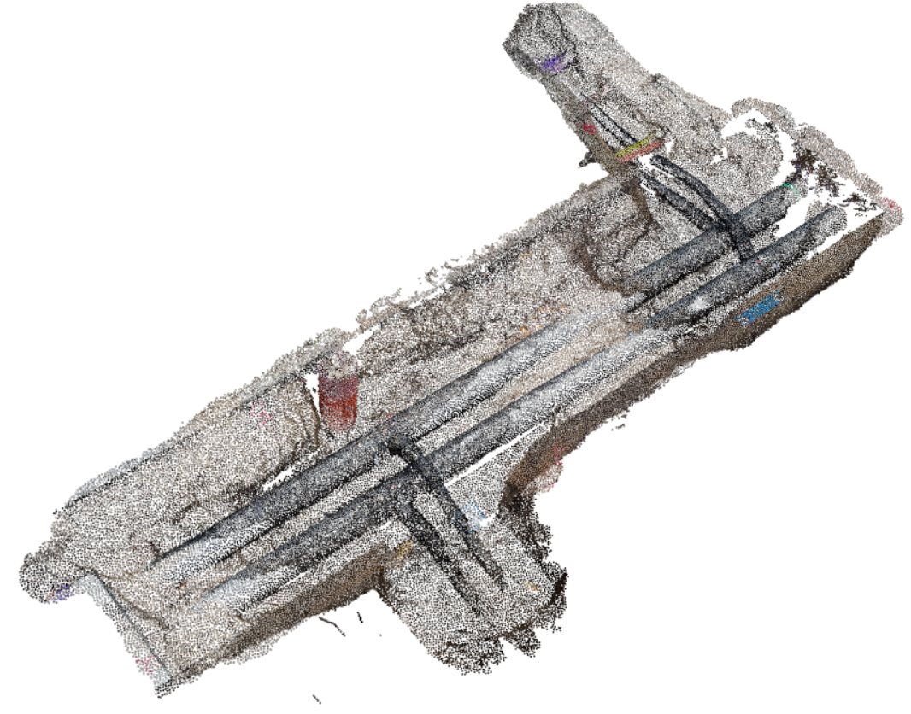
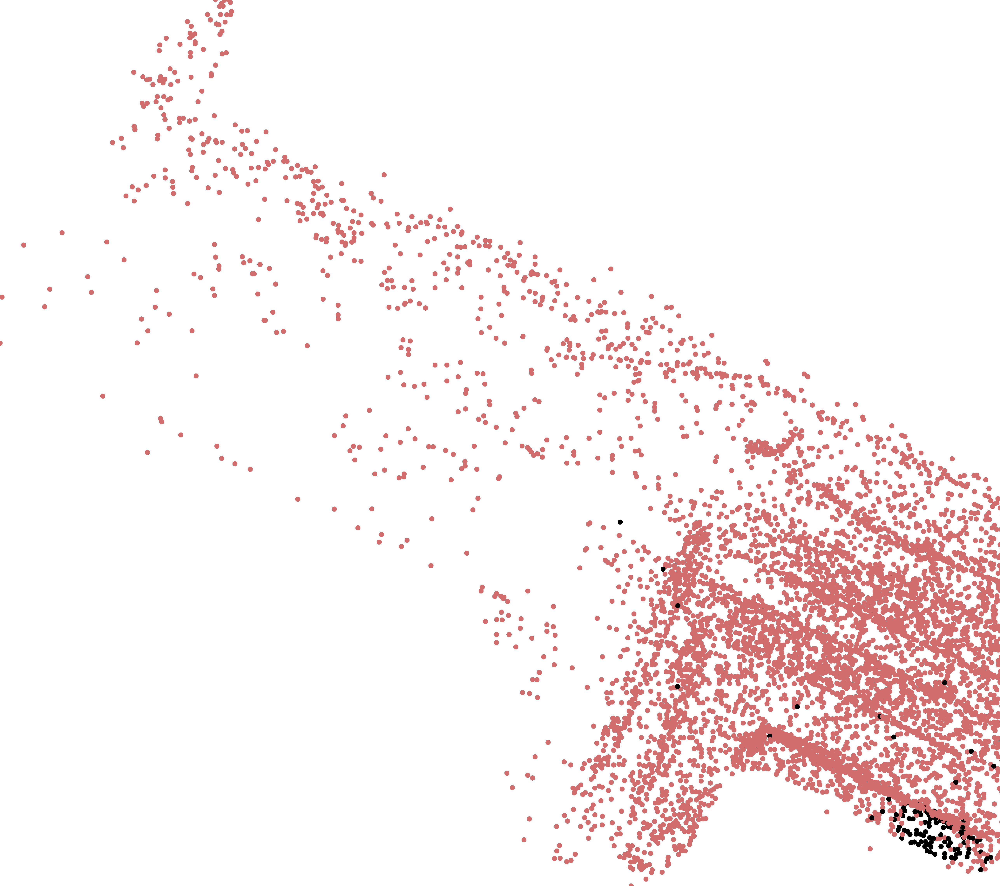
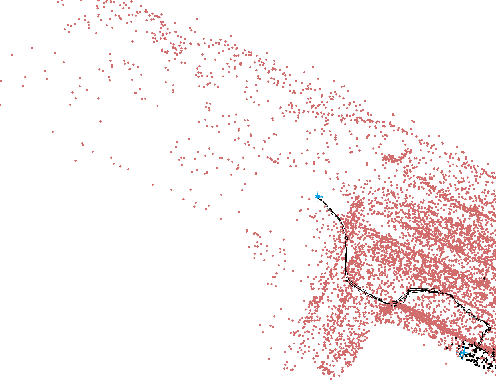

# cuAStar

cuAStar is a fast, lightweight, fully template,  single-file, header-only parallel implementation of the A* trajectory planner designed for dense point cloud datasets.

## Dataset
The dataset used for this project is [OpenTrench3D](https://www.kaggle.com/datasets/hestogpony/opentrench3d).

## Environment Setup
To set up your environment, follow these steps:

1. Open the Visual Studio Developer Command Prompt:
"C:\Program Files (x86)\Microsoft Visual Studio\2022\BuildTools\Common7\Tools\VsDevCmd.bat"

2. Generate Visual Studio project files using CMake:

3. Build the project in Release configuration:

## Tests
Currently, building the test suite requires a batch script which is not yet available.

## Examples
build exempleare intred to  be placed in  folder, 

## Documentation
the daetailed documenattaion of class and function in [cuAStar](https://wissem01chiha.github.io/cuAStar/)

## Benchmark
Performance benchmarks:

- Node setup time: 74 ms
- Chunk open set computation time: 13562 ms
- Trajectory computation time: 47 ms
- 2D Trajectory visualization time: 1970 ms
- Total execution time: 21189 ms
