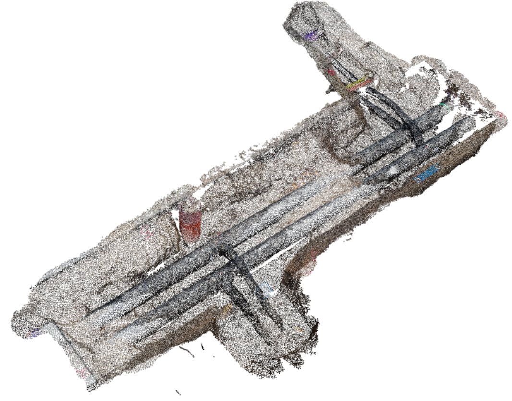
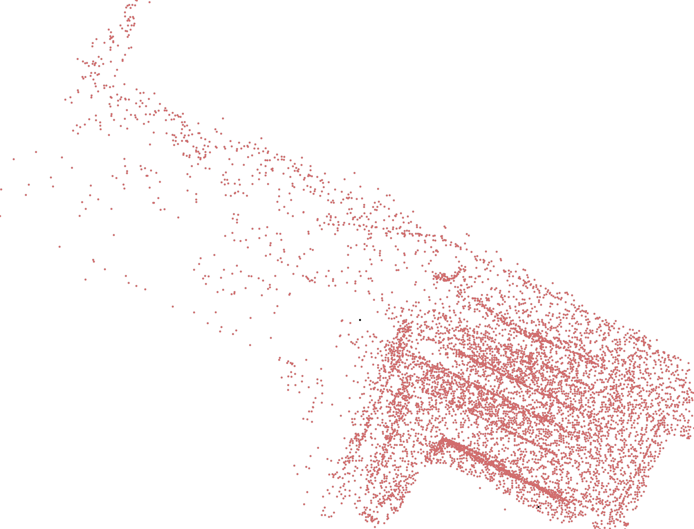
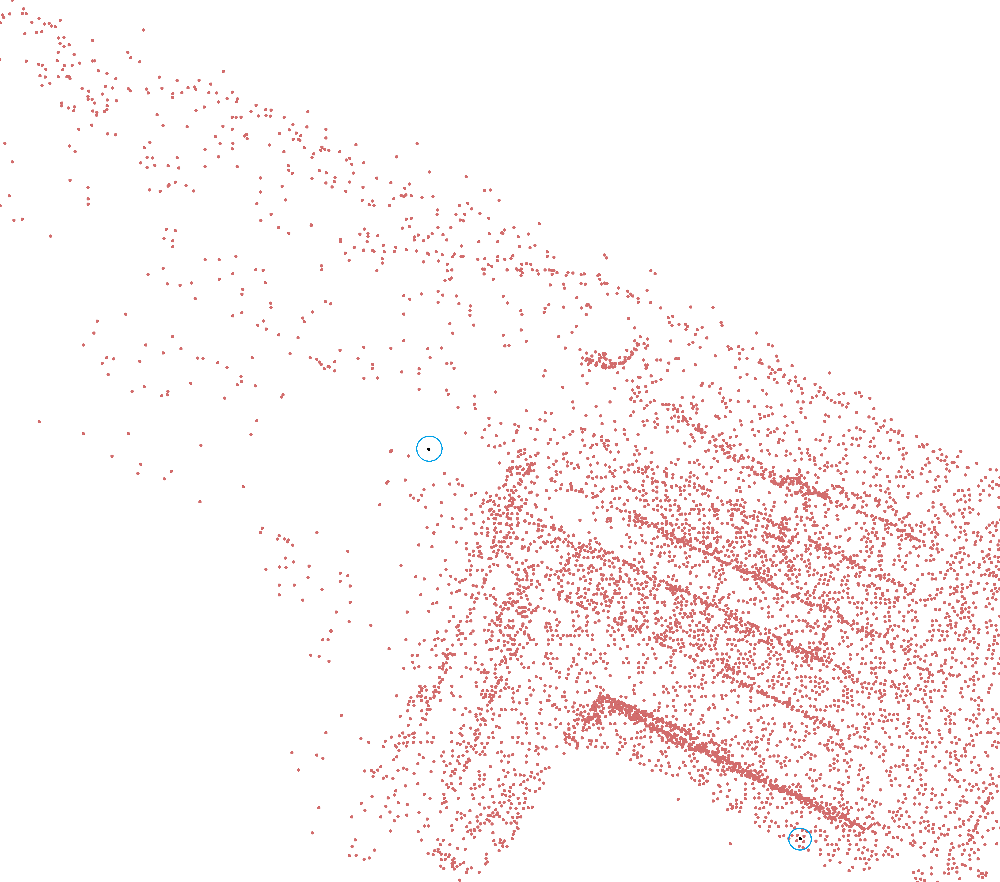

<h1 align="center" style="font-family: Arial, sans-serif;">cuAstar</h1>

 <p align="center">
   
    
      
    <a href="https://github.com/wissem01chiha/cuAstar/issues">
      
    <a href="https://wissem01chiha.github.io/cuAStar/">
    
    <a href="https://twitter.com/intent/tweet?text=Try this Counter-Strike 2 autoexec:&url=https%3A%2F%2Fgithub.com%2FArmynC%2FArminC-AutoExec">
    
</p>
<h5 align="center">Fast, modern, fully templated, single-file, header-only, parallel implementation of A* trajectory planner on NVIDIA GPUs in point cloud data.</h5>
<p align="center">
  <a href="#installation">Installation</a> •
  <a href="#updating">Updating</a> •
  <a href="#dataset">Dataset</a> •
  <a href="#benchmark">Benchmark</a> •
  <a href="#features">Features</a> •
  <a href="#dependencies">Dependencies</a>•  
  <a href="#wiki">Wiki</a> •
  <a href="#examples">Examples</a> •
  <a href="#to-do">Todo</a> •
  <a href="#contributing">Contributing</a> •
  <a href="#license">License</a>
</p>
      
---
**cuAstar** is a template cuda-based implementation, proposed by me, for generating fast, optimal trajectories within scanned point cloud data. It supports handling and rendering of both 2D and 3D points.

> [!NOTE]  
> This is an experimental version. Trajectory computation time and optimality may not be the best, and optimizations are required. Check the [To-Do](#to-do) section for more information.

> There is no CPU version of **cuAstar** this is a work in progress.
  
## Dependencies

Building the library requires an NVIDIA-capable device with the CUDA Toolkit installed, as well as CMake.

- [CMake](https://cmake.org/download/)
- [NVIDIA GPU Computation Toolkit](https://docs.nvidia.com/cuda/cuda-installation-guide-microsoft-windows/index.html)

The library is designed to maintain a header-only structure, so lightweight header-only libraries are used for data file processing and logging:

- [rapidcsv](https://github.com/d99kris/rapidcsv) for reading and writing CSV trajectory files.
- [happly](https://github.com/nmwsharp/happly) for parsing point cloud `.ply` files.
- [loguru](https://github.com/emilk/loguru) for enhanced logging in debug mode.
- [stb_image](https://github.com/nothings/stb) for reading and writing image formats.

> [!WARNING]   
> The minimum C++ standard required is C++17. Ensure that your compiler supports the standard features.

## Installation

For building platform-specific binaries and test executables:

```shell
   git clone https://github.com/wissem01chiha/cuAStar
```

Build the code in Release configuration with default CMake options and flags:

```shell
   mkdir build 
   cd build 
   cmake -G "Visual Studio 17 2022" ..
   cmake --build . --config Release 
```

By default, tests are built when compiling the code:

```shell
   cmake -G "Visual Studio 17 2022"  -DBUILD_TESTS=ON ..
```
Build with examples support:

```shell
   cmake -G "Visual Studio 17 2022"  -DBUILD_EXEMPLES=ON ..
``` 
For developing or integrating the project into your codebase, just download the [cuAstar](include/cuAstar) folder, ensure required libraries are installed, and include the librray with
```cpp
   #define CUASTAR_IMPLEMENTATION 
   #include <cuAstar/cuAstar.hpp>
   ...
```
cuAstar includes internal debugging features which are non-dependent on compiler-specific debugging options. These features can be used with the following macro:

```cpp
   #define CUASTAR_DEBUG 
```

> [!NOTE] 
> When the debug macro is not set, cuAstar uses a default shell logging format, so there is no need to link against the [loguru](https://github.com/emilk/loguru) library.


**VTK Integration**

3D Point cloud enviroment and trajectory debuging data uses [Visualization Toolkit](https://vtk.org/), while is not offically tested or supported, by cuAstar, for any bugs encountered during installation, please make sure to open an issue at: [Issues](https://github.com/wissem01chiha/cuAStar),

```shell
   cmake -G "Visual Studio 17 2022" -DUSE_VTK=ON  ..
``` 
For building and installing the Visualization Toolkit, refer to the official documentation: [install VTK](https://docs.vtk.org/en/latest/build_instructions/build.html)
 

## Dataset
We used a random sample of the [OpenTrench3D](https://www.kaggle.com/datasets/hestogpony/opentrench3d) dataset as a test dataset for this project. The original data files (containing more than 1 million points) were downsampled using [MeshLab](https://www.meshlab.net/) software to a maximum of 100,000 points.

other data samples could be found at [Point Cloud Datasets](https://github.com/antao97/PointCloudDatasets)


## Examples

**cuAstar** uses basic template classes for 2D and 3D point representation. All data is stored in arrays, and the standard C++ library is avoided for CUDA compatibility issues.

**Construct a Basic 2D and 3D Node**

```cpp
Node3d<double> node3(1.0, 2.0, 5.0);
Node2d<double> node2(1.0, 2.0);
```

**Initialize the Planner with a Given Point Cloud Dataset File**
```cpp
   AstarPlanner<Node3d<float>,float> planner("point_cloud_file.ply");
```
**Initialize the Planner with a Random 2D or 3D Point Cloud**
```cpp
   int pointNum = 1000;
   unsigned int seed = 50;

   AstarPlanner<Node3d<float>,float> planner(pointNum, seed);
```

**Initialize the Planner with a Given Array of Nodes**
```cpp
   Node3d<float>* h_nodesArray = new NodeType[1024];
    for (size_t i = 0; i < 1024; ++i) {
        h_nodesArray[i] = Node3d<float>(i * 1.0, i * 2.0, i * 3.0);
    }
   AstarPlanner<Node3d<float>,float> planner(h_nodesArray);
```

**Project Point Cloud in 2D Plane Along the Z-Axis**
```cpp 
   AstarPlanner<Node3d<float>,float> planner("point_cloud_file.ply");
   planner::visualize2dPointCloud("point_cloud_image.png");
```

<p align="center">
  
</p>

**Render the Point Cloud Distribution in 3D Using VTK**

```cpp 
   AstarPlanner<Node3d<float>,float> planner("point_cloud_file.ply");
   planner::visualize3dPointCloud("point_cloud_image.png");
```



**Process Data and Compute Chunks Open Set Arrays**

These arrays represent candidate nodes for exploration. For each chunk, a fixed number 𝐾 nodes are computed in the open set based on the minimum value of the cost function:
$$
f(n) = g(n) + h(n)
$$
The heuristic function ℎ(𝑛) estimates the cost from node 𝑛 to the goal.

This process eliminates far-away nodes from the possible optimal trajectory candidate nodes.
```cpp
   AstarPlanner<Node3d<float>,float> planner("point_cloud_file.ply");
   Node3d<float> start(82.029, 48.097, 1.174);
   Node3d<float> end(84.009, 50.173, 2.073);
   planner.setTargetNode(&end);
   planner.setInitialNode(&start);
   planner.computeChunkOpenSet();
```

<p align="center">
  
   
</p>

>[!IMPORTANT]
> uses chunks to parallelize the computation of the open set across multiple nodes. Each chunk's maximum size is the maximum number of threads per block supported by the GPU device (default value is 128). Increasing this value may slow down chunk processing and create large gaps between nodes.

>[!NOTE]
> Instead of using long templated expressions for classes and structs, you can define custom types with typedefs by defining the CUASTAR_USE_TYPEDEF macro:
```cpp
   Node3d<double> node3(1.0, 2.0, 5.0);
   Node2d<double> node2(1.0, 2.0);
```
This is equivalent to writing:
```cpp
   #define CUASTAR_USE_TYPEDEF
   Node3dDouble node3(1.0, 2.0, 5.0);
   Node2dDouble node2(1.0, 2.0);
```

## Documentation
The detailed documentation of the planner class members and CUDA functions could be found at  [cuAStar](https://wissem01chiha.github.io/cuAStar/)

**Building Documentation**

The documentation was built using the interoperability between Doxygen and Sphinx tools.
You need to install [Doxygen](https://www.doxygen.nl/), [Sphinx](https://www.sphinx-doc.org/), 
and [Breathe](https://breathe.readthedocs.io/).


```shell
   doxygen Doxyfile 
   sphinx-build -b html .  docs/build   
```

## Benchmark

Performance benchmarks for two different node sets are provided below. The tests were conducted on an Nvidia RTX GeForce 3050, CUDA 12.5, Microsoft Visual Studio 17 2022, and Windows 11.

| Execution Task                  | 93,340 Nodes | 24,463 Nodes |
|---------------------------------|--------------|--------------|
| Node Setup                      | 74 ms        | 45 ms        |
| Chunk Open Set Computation      | 13,562 ms    | 8,000 ms     |
| Trajectory Computation Time     | 47 ms        | 25 ms        |
| 2D Trajectory Visualization     | 1,970 ms     | 1,300 ms     |
| Total Execution Time            | 21,189 ms    | 9,370 ms     |

> [!IMPORTANT]
> These values are heavily dependent on GPU computing capability, CUDA version, CPU cores, and other hardware configurations. Additionally, these values may vary between different executions even in the same environment. Consider averaging results for more reliable performance metrics.

### To-Do

1. **Improve Memory Management**:
   - Focus on addressing memory management issues to optimize performance and prevent leaks.

2. **Change Testing Strategy**:
   - Transition to framework-based tests. We recommend starting with [Catch2](https://github.com/catchorg/Catch2).

3. **Debug VTK Related Helper Functions**:
   - Fix issues related to VTK helper functions to ensure proper functionality.

4. **Change K-Nearest Neighbor Computation**:
   - Replace the current distance-based brute force method with more efficient algorithms.

5. **Deployment to Package Managers**:
   - Prepare deployment to package managers like [vcpkg](https://github.com/microsoft/vcpkg), [Conan](https://conan.io/), and [CPM](https://github.com/cpm-cmake/CPM.cmake) for dependency management.

6. **Implement Stop Condition for Target Reached**:
   - Include a test based on reached nodes. Currently, there is no stop condition when the target is reached during chunk computation.

7. **Consider Parallel KD-Tree Implementation**:
   - Explore the implementation of a parallel KD-tree structure for point clouds to improve efficiency.

8. **Use Google Benchmark Framework**:
   - Integrate [Google Benchmark](https://github.com/google/benchmark) for more accurate benchmarking tasks.

9. **Automate Documentation Build and Deployment**:
   - Automate the documentation build process and consider deploying it to a dedicated documentation site instead of GitHub Pages.

10. **Add More Tests**:
    - Expand the test suite to cover additional scenarios and edge cases.

11. **Avoid Dynamic Parallelism in CUDA Kernels**:
    - Refactor CUDA kernels to avoid using dynamic parallelism to enhance performance.

12. **Standardize Functions for Non-Point Cloud Data**:
    - Work on standardizing functions to handle various types of data, such as lidar and images.

13. **Explore Python Binding**:
    - Investigate the feasibility of creating bindings for Python to enhance accessibility.

14. **Dynamic Chunks Sizing or Advanced Exploration Algorithms**:
    - Consider implementing a dynamic chunks sizing option or explore more advanced exploration algorithms.


 
## Contributing
Contribuation are welcome.  

Feel free to mail to :  
- chihawissem08@gmail.com 
## License
This project is actually under The BSD-2-Clause license, see [License](LICENSE) file for more details.

### Cite This Work

```bibtex
@misc{cuAstar,
  author       = {wissem chiha},
  title        = {cuAstar},
  year         = {2024},
  url          = {https://github.com/wissem01chiha/cuAStar}
}
